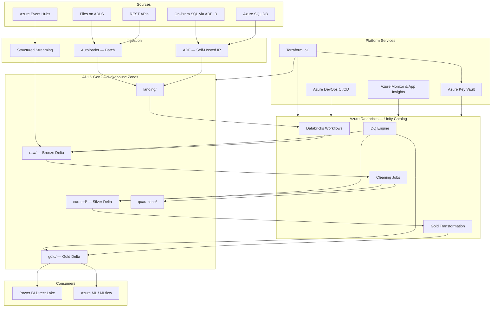

# Azure Lakehouse Data Platform
## Multi-Agent Agentic AI — Data Engineering Blueprint

> **Stack:** Azure Databricks (Unity Catalog) · ADLS Gen2 · Azure DevOps · Terraform  
> **Compliance:** GDPR / SOC2  
> **Languages:** Python (PySpark) · SQL · YAML · HCL (Terraform)

---

## Architecture Overview



---

## Agent Team & Deliverables

| Agent | Key Artifacts |
|---|---|
| **Architect & Orchestrator** | `docs/01_architecture_design.md` — full architecture, zone layout, tech decisions |
| **Data Ingestion Agent** | `src/ingestion/` · `configs/sources/` — Autoloader, JDBC, Event Hubs streaming |
| **Data Cleaning Agent** | `src/cleaning/` — Bronze→Silver, cleaning utils, quarantine handler |
| **Transformation Agent** | `src/transformation/` — SCD2 dim_customer, SCD1 dim_product, fact_sales |
| **DQ & Observability Agent** | `src/quality/` · `configs/quality/` — DQ engine, Azure Monitor alerting |
| **Security & Governance Agent** | `src/governance/` — Unity Catalog RBAC, column masking, data classification |
| **CI/CD & DevOps Agent** | `.azure-pipelines/` · `databricks.yml` · `infra/terraform/` |

---

## Repository Structure

```
AgenticAI-DataEngineering/
├── docs/
│   ├── 01_architecture_design.md          ← Architecture + Mermaid diagrams
│   ├── 02_data_models_quality_security.md ← Schema specs, cleaning rules, RBAC
│   ├── 03_implementation_blueprint.md     ← This README + code index
│   └── 04_runbook_operational_guidelines.md ← Onboarding, debugging, incidents
│
├── src/
│   ├── ingestion/
│   │   ├── batch/
│   │   │   ├── autoloader_ingestion.py    ← ADLS file → Bronze Delta (Autoloader)
│   │   │   └── sql_ingestion.py           ← Azure SQL → Bronze Delta (JDBC)
│   │   ├── streaming/
│   │   │   └── eventhub_streaming.py      ← Event Hubs → Bronze Delta (Structured Streaming)
│   │   └── metadata/
│   │       └── metadata_logger.py         ← Audit metadata Delta table
│   ├── cleaning/
│   │   ├── cleaning_utils.py              ← Reusable PySpark cleaning functions
│   │   ├── bronze_to_silver.py            ← Bronze → Silver job (sales orders)
│   │   └── quarantine_handler.py          ← Quarantine write + reprocessing
│   ├── transformation/
│   │   └── silver_to_gold.py              ← SCD2 dims + fact_sales Gold builder
│   ├── quality/
│   │   ├── dq_checks.py                   ← DQ engine (completeness/uniqueness/range/freshness)
│   │   └── alerting.py                    ← App Insights + Azure Monitor + ADO work items
│   └── governance/
│       ├── unity_catalog_setup.py         ← Catalog/schema/grant provisioning
│       └── data_masking.py                ← PII pseudonymization, masking, classification
│
├── configs/
│   ├── sources/
│   │   ├── azure_sql_source.yaml          ← Azure SQL source definition
│   │   ├── eventhub_source.yaml           ← Event Hubs source definition
│   │   └── file_source.yaml               ← File-based source definition
│   └── quality/
│       ├── bronze_dq_config.yaml          ← Bronze layer DQ rules
│       ├── silver_dq_config.yaml          ← Silver layer DQ rules (blocking)
│       └── gold_dq_config.yaml            ← Gold layer DQ rules (blocking + BI gate)
│
├── tests/
│   └── unit/
│       ├── test_cleaning_utils.py         ← pytest: all cleaning utility functions
│       └── test_dq_checks.py              ← pytest: DQ engine (completeness/uniqueness/range)
│
├── infra/
│   └── terraform/
│       ├── main.tf                        ← ADLS, Databricks, Key Vault, Monitor, ADF, Event Hubs
│       └── variables.tf                   ← All configurable variables with validation
│
├── .azure-pipelines/
│   ├── ci-pipeline.yaml                   ← Lint → Unit Tests → Security Scan → Notebook Validation
│   └── cd-pipeline.yaml                   ← DEV → Integration Tests → TEST (approval) → PROD (approval)
│
├── databricks.yml                         ← Databricks Asset Bundle: workflows, clusters, targets
├── pyproject.toml                         ← Tool configs: ruff, black, isort, mypy, pytest, coverage, bandit
├── requirements.txt                       ← Pinned Python dependencies (PySpark, testing, linting, security)
└── README.md                              ← This file
```

---

## Quick Start

### 1. Prerequisites

- Azure subscription with Contributor access
- Azure Databricks Premium workspace with Unity Catalog enabled
- Azure DevOps organization
- Terraform ≥ 1.8.0
- Databricks CLI ≥ 0.220.0

### 2. Provision Infrastructure

```bash
cd infra/terraform

# Initialize backend (Azure Storage)
terraform init \
  -backend-config="resource_group_name=rg-lakehouse-tfstate" \
  -backend-config="storage_account_name=stlakehousetestate" \
  -backend-config="container_name=tfstate" \
  -backend-config="key=dev/terraform.tfstate"

# Plan and apply for dev
terraform apply \
  -var="environment=dev" \
  -var="location=westeurope"
```

### 3. Set Up Secrets in Key Vault

```bash
# JDBC connection string for Azure SQL
az keyvault secret set \
  --vault-name kv-lakehouse-dev-XXXXXX \
  --name "azure-sql-sales-jdbc-url" \
  --value "jdbc:sqlserver://..."

# Event Hubs connection string
az keyvault secret set \
  --vault-name kv-lakehouse-dev-XXXXXX \
  --name "eventhub-sales-connection-string" \
  --value "Endpoint=sb://..."
```

### 4. Deploy to Databricks

```bash
# Authenticate
databricks configure --host https://<workspace>.azuredatabricks.net

# Deploy to dev
databricks bundle deploy --target dev

# Setup Unity Catalog (run once)
databricks runs submit --json '{
  "existing_cluster_id": "<cluster_id>",
  "python_file": "dbfs:/src/governance/unity_catalog_setup.py",
  "parameters": ["--env", "dev", "--storage_account", "<storage_account>"]
}'
```

### 5. Run CI/CD

Push a branch and open a Pull Request against `main`.  
The CI pipeline runs automatically.  
After merge, CD deploys to DEV automatically; TEST and PROD require approval.

---

## Data Flow Summary

```
Sources → landing/ (raw files/DB extracts)
        → raw/     (Bronze Delta — append-only, schema evolution, immutable)
        → curated/ (Silver Delta — cleaned, typed, deduplicated, PII masked)
        → gold/    (Gold Delta — star schema, SCD2 dims, aggregated facts)
        → quarantine/ (rejected records with error reasons for reprocessing)
```

**Orchestration:** Databricks Workflows DAG  
`ingest → bronze DQ → silver clean → silver DQ → gold dims (parallel) → gold fact → gold DQ`

---

## Key Design Decisions

| Decision | Choice | Rationale |
|---|---|---|
| Primary orchestrator | Databricks Workflows | Native Spark integration; no extra service cost; GitOps via DAB |
| File ingestion | Databricks Autoloader | Auto schema evolution, exactly-once checkpointing, ADLS native |
| Streaming ingest | Structured Streaming + Event Hubs | Micro-batch with watermarking; simpler than Kafka for Azure-native |
| Table format | Delta Lake (only) | ACID, time travel, MERGE, Z-Order, Unity Catalog integration |
| Incremental load | Watermark-based (max timestamp) | Simple, reliable, handles late data without CDC complexity |
| SCD strategy | Type 2 for customers, Type 1 for products | Preserve customer history; products need current state only |
| IaC | Terraform | Widest Azure provider coverage; backend state in ADLS |
| CI/CD | Azure DevOps Pipelines + DAB | Native ADO integration; DAB handles workspace promotion |
| Security | Unity Catalog + Azure Key Vault | Single governance plane; no secrets in code |

---

## Compliance Notes

- **GDPR**: PII columns (`email`, `phone`, `name`) are masked in Unity Catalog using Column Masks.  
  Data engineers see plaintext; all other roles see masked values.  
  Quarantine records retain raw PII for forensics — access restricted to `data_engineers` only.

- **Data Subject Requests (DSR)**: Use `customer_id` as the pseudonymous key to identify and  
  delete/export all records. Quarantine table includes `raw_record` JSON — must be included in DSR scope.

- **Audit Logging**: All data access events recorded in `system.access.audit` (Unity Catalog system table).  
  Databricks diagnostic logs stream to Log Analytics for 90-day retention.

- **Encryption**: Storage Service Encryption (AES-256) at rest; TLS 1.2+ in transit.  
  Customer-Managed Keys (CMK) configurable via Terraform (Key Vault key reference).

---

## Testing

```bash
# Install all dev dependencies (uses pyproject.toml)
pip install -e ".[dev]"

# Run unit tests with coverage (settings from [tool.pytest] + [tool.coverage])
pytest tests/unit/ --cov=src --cov-report=term-missing

# Run linting (settings from [tool.ruff])
ruff check src/ tests/

# Check formatting (settings from [tool.black])
black --check src/ tests/

# Type checking (settings from [tool.mypy])
mypy src/

# SAST security scan (settings from [tool.bandit])
bandit -r src/

# Dependency CVE scan
pip-audit
```

All tool behaviour (line length, target Python version, ignored rules, coverage threshold, test markers) is centralised in `pyproject.toml` — no per-tool config files needed.

---

## Related Documentation

- [Architecture & Design](docs/01_architecture_design.md)
- [Data Models, Quality & Security](docs/02_data_models_quality_security.md)
- [Runbook & Operational Guidelines](docs/04_runbook_operational_guidelines.md)
- [Azure Databricks Documentation](https://docs.databricks.com)
- [Unity Catalog Overview](https://docs.databricks.com/en/data-governance/unity-catalog/index.html)
- [Delta Lake Documentation](https://docs.delta.io/latest/index.html)
