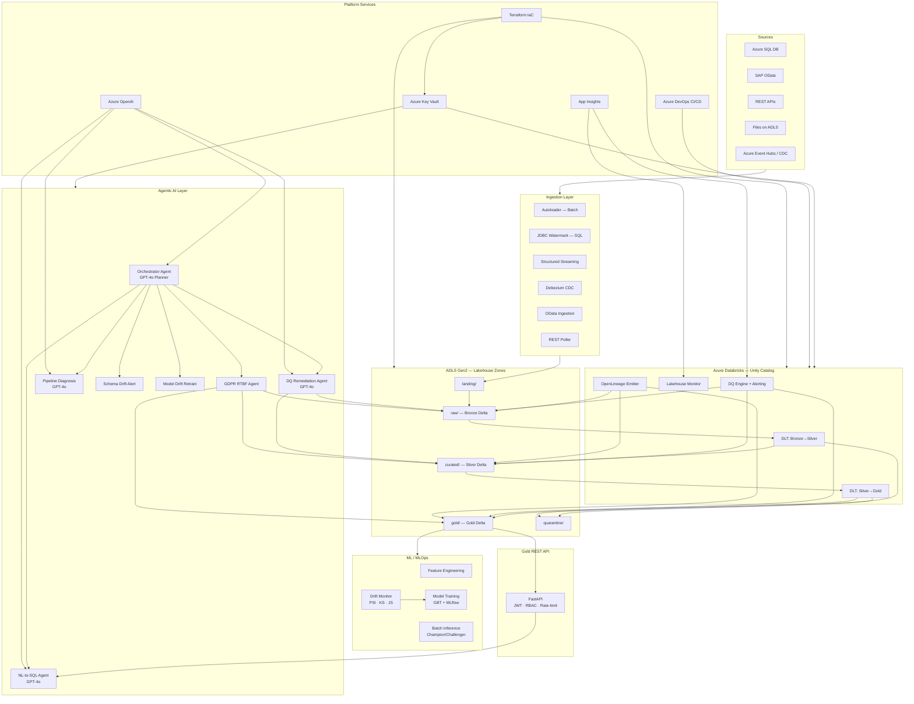

# Azure Lakehouse Data Platform
## Multi-Agent Agentic AI — Data Engineering Blueprint

> **Stack:** Azure Databricks (Unity Catalog) · ADLS Gen2 · Azure OpenAI GPT-4o · FastAPI · MLflow · OpenLineage · Azure DevOps · Terraform
> **Compliance:** GDPR Article 17 / SOC2
> **Languages:** Python (PySpark) · SQL · YAML · HCL (Terraform)

---

## Architecture Overview



---

## Agent Team & Deliverables

| Agent | Key Artifacts |
|---|---|
| **Data Ingestion Agent** | `src/ingestion/` · `configs/sources/` — Autoloader, JDBC, Event Hubs, CDC (Debezium), OData, REST |
| **Data Cleaning Agent** | `src/cleaning/` · `src/dlt/bronze_to_silver_dlt.py` — Bronze→Silver, DLT pipeline, quarantine |
| **Transformation Agent** | `src/transformation/` · `src/dlt/silver_to_gold_dlt.py` — SCD2 dims, fact_sales, DLT pipeline |
| **DQ & Observability Agent** | `src/quality/` · `configs/quality/` — DQ engine, App Insights alerting, Lakehouse Monitor |
| **Orchestrator Agent** | `src/agents/orchestrator_agent.py` — GPT-4o event planner; routes DQ/GDPR/NL/PIPELINE/SCHEMA/MODEL_DRIFT events to sub-agents; rule-based fallback; immutable audit log |
| **DQ Remediation Agent** | `src/agents/dq_remediation_agent.py` — GPT-4o classifies failures → auto-impute/quarantine/reject |
| **GDPR RTBF Agent** | `src/agents/gdpr_rtbf_agent.py` — Article 17 erasure across all Delta layers with audit log |
| **NL-to-SQL Agent** | `src/agents/nl_to_sql_agent.py` — Natural language → validated SQL → Gold layer execution |
| **MLOps Agent** | `src/ml/` — Feature engineering, GBT training, batch inference, champion/challenger, drift monitor |
| **Data Lineage Agent** | `src/lineage/openlineage_emitter.py` — OpenLineage events to Marquez / Microsoft Purview |
| **Gold REST API** | `src/api/gold_api.py` — FastAPI with Azure AD JWT, RBAC, rate limiting, NL-to-SQL router |
| **Security & Governance Agent** | `src/governance/` — Unity Catalog RBAC, column masking, encryption, row-level security, Delta Sharing |
| **CI/CD & DevOps Agent** | `.azure-pipelines/` · `databricks.yml` · `infra/terraform/` · `Makefile` |

---

## Repository Structure

```
AgenticAI-DataEngineering/
├── .azure-pipelines/
│   ├── ci-pipeline.yaml            ← Lint → Unit Tests → Security Scan → bundle validate
│   └── cd-pipeline.yaml            ← DEV (auto) → TEST (approval) → PROD (approval)
│
├── .azuredevops/
│   └── pull_request_template.md    ← PR checklist enforced on every PR
│
├── .vscode/
│   ├── settings.json               ← Python interpreter, ruff, formatter, test discovery
│   ├── extensions.json             ← Recommended extensions (Pylance, Ruff, Databricks…)
│   └── launch.json                 ← Debug configs for every pipeline script + API server
│
├── configs/
│   ├── sources/                    ← YAML source configs (SQL, REST, Event Hubs, OData, File)
│   └── quality/                    ← DQ rule configs per layer (bronze / silver / gold)
│
├── docs/
│   ├── 01_architecture_design.md
│   ├── 02_data_models_quality_security.md
│   └── 04_runbook_operational_guidelines.md
│
├── infra/terraform/
│   ├── main.tf                     ← ADLS, Databricks, Key Vault, Monitor, ADF, Event Hubs
│   └── variables.tf
│
├── scripts/
│   └── seed_local.py               ← Seed all local Delta tables with synthetic data
│
├── src/
│   ├── agents/
│   │   ├── orchestrator_agent.py   ← GPT-4o planner + multi-agent event router (NEW)
│   │   ├── dq_remediation_agent.py ← GPT-4o DQ failure classifier + auto-remediator
│   │   ├── gdpr_rtbf_agent.py      ← GDPR Article 17 erasure agent (anonymize / delete)
│   │   └── nl_to_sql_agent.py      ← Natural language → validated SQL agent
│   │
│   ├── api/
│   │   └── gold_api.py             ← FastAPI REST API over Gold Delta (JWT · RBAC · rate limit)
│   │
│   ├── cleaning/
│   │   ├── bronze_to_silver.py     ← Bronze→Silver PySpark job (OpenLineage instrumented)
│   │   ├── cleaning_utils.py       ← Reusable PySpark cleaning functions
│   │   └── quarantine_handler.py
│   │
│   ├── dlt/
│   │   ├── bronze_to_silver_dlt.py ← Delta Live Tables declarative Bronze→Silver pipeline
│   │   └── silver_to_gold_dlt.py   ← Delta Live Tables declarative Silver→Gold pipeline
│   │
│   ├── governance/
│   │   ├── unity_catalog_setup.py
│   │   ├── column_encryption.py
│   │   ├── data_masking.py
│   │   ├── delta_sharing.py
│   │   └── row_level_security.py
│   │
│   ├── ingestion/
│   │   ├── batch/                  ← Autoloader + JDBC watermark ingestion
│   │   ├── cdc/                    ← Debezium CDC over Event Hubs
│   │   ├── cdf/                    ← Delta Change Data Feed propagation
│   │   ├── odata/                  ← SAP OData ingestion
│   │   ├── rest/                   ← Generic paginated REST API poller
│   │   ├── streaming/              ← Event Hubs structured streaming
│   │   └── metadata/               ← Ingestion audit metadata logger
│   │
│   ├── lineage/
│   │   └── openlineage_emitter.py  ← OpenLineage events → Marquez / Microsoft Purview
│   │
│   ├── ml/
│   │   ├── feature_engineering.py
│   │   ├── model_training.py       ← GBT CLV model + MLflow tracking
│   │   ├── batch_inference.py      ← Daily batch scoring + champion/challenger comparison
│   │   └── model_drift_monitor.py  ← PSI · KS · JS drift detection + retraining trigger
│   │
│   ├── monitoring/
│   │   └── lakehouse_monitor.py    ← Databricks Lakehouse Monitor integration
│   │
│   ├── quality/
│   │   ├── dq_checks.py            ← DQ engine (completeness · uniqueness · range · freshness)
│   │   └── alerting.py             ← App Insights metrics + ADO work item creation
│   │
│   ├── transformation/
│   │   └── silver_to_gold.py       ← Batch SCD2 dims + fact_sales (pre-DLT fallback)
│   │
│   └── utils/
│       ├── config.py               ← Shared YAML config loader (LRU cached)
│       ├── dbutils_shim.py         ← dbutils compatibility shim (Databricks + local)
│       └── logger.py               ← Shared structured logger (get_logger(__name__))
│
├── tests/
│   ├── integration/
│   │   ├── conftest.py             ← Local SparkSession fixture (Delta Lake)
│   │   ├── synthetic_data.py       ← Deterministic test data generators
│   │   ├── test_bronze_to_silver.py
│   │   ├── test_dq_checks.py
│   │   └── test_silver_to_gold.py
│   └── unit/
│       ├── test_cleaning_utils.py
│       └── test_dq_checks.py
│
├── .env.example                    ← Template for all 30+ env vars — copy to .env
├── .gitignore
├── .pre-commit-config.yaml         ← ruff · black · bandit · detect-secrets · terraform fmt
├── databricks.yml                  ← Databricks Asset Bundle: jobs, DLT pipelines, targets
├── Makefile                        ← make install / test / lint / deploy-dev / deploy-prod
├── pyproject.toml                  ← ruff · black · mypy · pytest · coverage · bandit config
├── requirements.txt                ← All pinned Python dependencies
└── README.md
```

---

## Quick Start — New Developer

> **Prerequisite tools:** Python 3.11+, Java 11+, Git, VS Code, GNU Make (or WSL on Windows), Databricks CLI ≥ 0.220, Azure CLI, Terraform ≥ 1.8.

### 1 — Clone & open in VS Code

```bash
git clone https://github.com/PratikhyaManas/AgenticAI-DataEngineering.git
cd AgenticAI-DataEngineering
code .
# VS Code prompts "Install recommended extensions?" → click Yes
```

### 2 — Configure environment

```bash
cp .env.example .env      # edit .env with real values (Databricks, OpenAI, ADLS, etc.)
```

### 3 — Install dependencies & enable git hooks

```bash
make install
# Creates .venv, installs all deps (runtime + dev), enables pre-commit hooks
```

### 4 — Seed local Delta tables

```bash
make seed-local
# Writes synthetic Bronze/Silver/Gold/MLOps Delta tables to /tmp/lakehouse_dev
```

### 5 — Run all tests locally

```bash
make test              # unit + integration tests (local Spark, no cluster needed)
make lint              # ruff + black check
make security          # bandit + pip-audit
```

### 6 — Debug in VS Code (F5)

`.vscode/launch.json` has pre-built debug configs for:
- Unit tests / integration tests
- Every pipeline script (`bronze_to_silver`, `sql_ingestion`, `model_drift_monitor`, …)
- Gold REST API (`make serve-api` or F5 → "API: Gold REST API")
- DQ Remediation Agent (dry-run)

### 7 — Deploy to Databricks

```bash
make bundle-validate   # validate databricks.yml
make deploy-dev        # deploy all jobs + DLT pipelines to DEV workspace
# After review:
make deploy-prod       # prompts for confirmation; requires manual gate in Azure DevOps
```

---

## Development Workflow (Git → PR → Pipeline → Prod)

```
feature/TICKET-123-my-change
        │
        │  git commit   ← pre-commit hooks run (ruff, black, bandit, detect-secrets)
        │  git push
        ▼
   Pull Request (Azure DevOps)
        │
        │  PR template auto-populates (.azuredevops/pull_request_template.md)
        │  CI pipeline triggers (ci-pipeline.yaml):
        │    Lint → Unit Tests → Integration Tests → Security Scan → bundle validate
        ▼
   Code Review + CI green → Merge to main
        │
        │  CD pipeline triggers (cd-pipeline.yaml):
        │    Terraform plan → Deploy DEV (auto) → Integration tests on DEV
        │    → Manual approval → Deploy TEST
        │    → Manual approval → Deploy PROD → Git tag release
        ▼
   Production
```

---

## Makefile Reference

| Command | What it does |
|---|---|
| `make install` | Create `.venv`, install all deps, enable pre-commit hooks |
| `make test` | Run unit + integration tests |
| `make test-unit` | Fast unit tests only (no Spark cluster) |
| `make test-integration` | Integration tests with local Spark + Delta Lake |
| `make test-coverage` | All tests with HTML coverage report |
| `make lint` | Ruff linter |
| `make format` | Black formatter |
| `make check` | All quality checks (CI equivalent) |
| `make security` | Bandit + pip-audit |
| `make seed-local` | Seed local Delta tables with synthetic data |
| `make serve-api` | Start Gold REST API at localhost:8000 |
| `make bundle-validate` | Validate `databricks.yml` |
| `make deploy-dev` | Deploy to DEV Databricks workspace |
| `make deploy-prod` | Deploy to PROD (confirmation required) |
| `make infra-plan` | Terraform plan for target environment |
| `make infra-apply` | Apply Terraform plan |
| `make pre-commit` | Run all pre-commit hooks against all files |
| `make clean` | Remove build artefacts and caches |
| `make clean-all` | Remove everything including `.venv` |

---

## Key Features

### Delta Live Tables (DLT)
`src/dlt/` contains declarative DLT pipelines that replace the imperative batch jobs:
- `bronze_to_silver_dlt.py` — `@dlt.expect_or_drop` quality gates, schema evolution, quarantine
- `silver_to_gold_dlt.py` — `dlt.apply_changes` for SCD Type 2 (customers) and SCD Type 1 (products)

### Gold REST API
`src/api/gold_api.py` — FastAPI service exposing the Gold Delta layer:
- Azure AD JWT validation (RS256 / JWKS)
- Role-based access: `analyst` / `data_scientist` / `admin`
- Rate limiting via SlowAPI; SQL injection prevention via parameterised queries
- NL-to-SQL router mounted at `/v1/nl-query`
- Interactive docs at `http://localhost:8000/docs` (when running locally)

### Agentic AI Layer

All agents are coordinated by the **Orchestrator Agent** (`src/agents/orchestrator_agent.py`), which polls `governance.orchestrator_events` every 15 minutes, uses GPT-4o to plan the optimal routing, and dispatches to the right sub-agent. A rule-based fallback engages automatically when the LLM is unavailable or returns confidence < 0.5. Every routing decision is written to the immutable `governance.orchestrator_log` Delta table.

| Agent | Trigger | Action |
|---|---|---|
| **Orchestrator** (`every 15 min`) | Any event in `governance.orchestrator_events` | GPT-4o planner routes to sub-agent; logs decision + result to `orchestrator_log` |
| **DQ Remediation** (`01:30 UTC daily` or via orchestrator) | DQ failures in `dq_results` table | GPT-4o picks strategy → IMPUTE / COERCE / DEDUPLICATE / QUARANTINE / REJECT |
| **GDPR RTBF** (on-demand or via orchestrator) | Subject erasure request | Anonymise (salted SHA-256) or DELETE across all 10 registered Delta tables |
| **NL-to-SQL** (real-time via API or orchestrator) | Business user question | Schema context → GPT-4o → SQL validation → Databricks SQL execution |
| **Pipeline Diagnosis** (via orchestrator) | `PIPELINE_FAILURE` event | GPT-4o root-cause analysis + remediation recommendation; escalated for human review |
| **Schema Drift Alert** (via orchestrator) | `SCHEMA_DRIFT` event | Logs drift to `governance.schema_drift_log`; escalates for human approval |
| **Model Drift Retrain** (via orchestrator) | `MODEL_DRIFT` event with severity HIGH/CRITICAL | Triggers retraining Databricks Workflow via Jobs REST API |

**Event types recognised by the orchestrator:**

```
DQ_FAILURE | GDPR_ERASURE_REQUEST | NL_QUERY | PIPELINE_FAILURE | SCHEMA_DRIFT | MODEL_DRIFT
```

Upstream jobs write events to `governance.orchestrator_events` (e.g. DQ checks write `DQ_FAILURE` on threshold breach). Events can also be injected on-demand using the `--event-type` / `--payload` CLI flags.

### MLOps Pipeline
| Component | Description |
|---|---|
| `feature_engineering.py` | Feature store integration; customer RFM features |
| `model_training.py` | GBT CLV model with MLflow tracking + reference distribution artifact |
| `batch_inference.py` | Daily scoring with 90% prediction intervals; champion/challenger comparison |
| `model_drift_monitor.py` | PSI / KS / JS drift detection; triggers retraining via Databricks Jobs API when `PSI > 0.25` or `KS p < 0.05` |

### OpenLineage Data Lineage
`src/lineage/openlineage_emitter.py` emits start/complete/fail events for every pipeline job. Integrates with **Marquez** (open-source) or **Microsoft Purview** via HTTP transport. All Bronze→Silver jobs are already instrumented.

---

## Data Flow

```
Sources
  → landing/           (raw files / DB extracts)
  → raw/ Bronze Delta  (append-only, schema evolution, immutable, OpenLineage)
  → curated/ Silver    (cleaned, typed, deduped, PII masked, DQ gated)
  → gold/ Gold Delta   (star schema, SCD2 dims, aggregated facts, CLV features)
  → quarantine/        (rejected records with error reasons for reprocessing)
```

**Orchestration DAG:**
```
ingest → bronze DQ → silver DLT → silver DQ
       → gold DLT → gold DQ → batch inference → drift monitor

Orchestrator (every 15 min):
  orchestrator_events
    ├── DQ_FAILURE        → DQ Remediation Agent
    ├── GDPR_ERASURE_REQUEST → GDPR RTBF Agent
    ├── NL_QUERY          → NL-to-SQL Agent
    ├── PIPELINE_FAILURE  → Pipeline Diagnosis (GPT-4o)
    ├── SCHEMA_DRIFT      → Schema Drift Alert
    └── MODEL_DRIFT       → Model Drift Retrain trigger
```

---

## Compliance

| Requirement | Implementation |
|---|---|
| **GDPR Article 17** | `gdpr_rtbf_agent.py` — multi-layer erasure with immutable audit log |
| **PII masking** | Unity Catalog Column Masks + `data_masking.py` (pseudonymization) |
| **Encryption** | AES-256 at rest (SSE); TLS 1.2+ in transit; CMK via Key Vault |
| **Audit logging** | `system.access.audit` (Unity Catalog) + `governance.gdpr_erasure_log` + `governance.nl2sql_audit_log` + `governance.orchestrator_log` (append-only, every routing decision) |
| **Data lineage** | OpenLineage events per job — queryable in Marquez / Purview |
| **Row-level security** | `row_level_security.py` — dynamic views scoped to business unit group membership |
| **Secret management** | All secrets in Azure Key Vault; `src/utils/dbutils_shim.py` provides local fallback via env vars |

---

## Key Design Decisions

| Decision | Choice | Rationale |
|---|---|---|
| Primary orchestrator | Databricks Workflows + DLT | Native Spark; GitOps via DAB; DLT handles quality gates declaratively |
| Multi-agent coordination | Orchestrator Agent + GPT-4o planner | Event-driven routing from `orchestrator_events` Delta table; rule-based fallback; confidence-gated LLM dispatch |
| File ingestion | Databricks Autoloader | Auto schema evolution; exactly-once checkpointing; ADLS native |
| Streaming ingest | Structured Streaming + Event Hubs + CDC | Micro-batch watermarking; Debezium for row-level CDC |
| Table format | Delta Lake (only) | ACID, time travel, MERGE, Z-Order, Unity Catalog integration |
| AI layer | Azure OpenAI GPT-4o | Managed, GDPR-compliant, enterprise SLA; no self-hosted LLM infra |
| REST API | FastAPI + Databricks SQL Connector | Low-latency Gold reads; standard OpenAPI docs; RBAC via Azure AD |
| Drift detection | PSI + KS + JS | Covers numeric (PSI/KS) and categorical (JS) features + prediction shift |
| Secret access | `dbutils_shim.py` | Single abstraction — real `dbutils` on Databricks, env-var fallback locally |
| Logging | `src/utils/logger.py` | Single `get_logger(__name__)` call — no scattered `print()` across modules |
| IaC | Terraform | Widest Azure provider coverage; remote state in ADLS |
| CI/CD | Azure DevOps Pipelines + DAB | Native ADO integration; DAB handles workspace promotion |

---

## Troubleshooting

| Symptom | Likely cause | Fix |
|---|---|---|
| `JAVA_HOME is not set` | JDK not installed | Install JDK 11 or 17; set `JAVA_HOME` |
| `ModuleNotFoundError: src` | Venv not activated or editable install missing | Activate `.venv`; run `make install` |
| `KeyError: secret not found` | Secret env var missing for local dev | Set `SCOPE_KEY=value` env var (see `.env.example`) |
| `DeltaTableNotFoundException` | Tables not seeded locally | Run `make seed-local` |
| `databricks bundle validate` fails | `databricks.yml` syntax error | Run `make bundle-validate` to see the exact error |
| `ruff: command not found` | Venv not active | Run `source .venv/bin/activate` (Linux) or `.\.venv\Scripts\Activate.ps1` (Windows) |
| `UNAUTHORIZED` on Databricks API | Expired PAT | Re-run `databricks configure` with a fresh token |
| `PSI / KS import error` | `scipy` not installed | Run `pip install scipy` or `make install` |

---

## Related Documentation

- [Architecture & Design](docs/01_architecture_design.md)
- [Data Models, Quality & Security](docs/02_data_models_quality_security.md)
- [Runbook & Operational Guidelines](docs/04_runbook_operational_guidelines.md)
- [Azure Databricks Asset Bundles](https://docs.databricks.com/en/dev-tools/bundles/)
- [Delta Live Tables](https://docs.databricks.com/en/delta-live-tables/)
- [Unity Catalog](https://docs.databricks.com/en/data-governance/unity-catalog/)
- [OpenLineage](https://openlineage.io/)
- [MLflow Model Registry](https://mlflow.org/docs/latest/model-registry.html)

