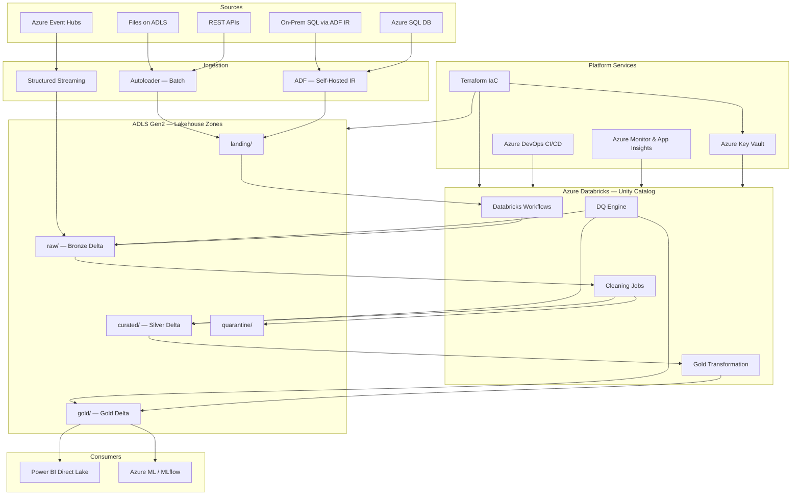

# Azure Lakehouse Data Platform
## Multi-Agent Agentic AI — Data Engineering Blueprint

> **Stack:** Azure Databricks (Unity Catalog) · ADLS Gen2 · Azure DevOps · Terraform  
> **Compliance:** GDPR / SOC2  
> **Languages:** Python (PySpark) · SQL · YAML · HCL (Terraform)

---

## Architecture Overview



---

## Agent Team & Deliverables

| Agent | Key Artifacts |
|---|---|
| **Architect & Orchestrator** | `docs/01_architecture_design.md` — full architecture, zone layout, tech decisions |
| **Data Ingestion Agent** | `src/ingestion/` · `configs/sources/` — Autoloader, JDBC, Event Hubs streaming |
| **Data Cleaning Agent** | `src/cleaning/` — Bronze→Silver, cleaning utils, quarantine handler |
| **Transformation Agent** | `src/transformation/` — SCD2 dim_customer, SCD1 dim_product, fact_sales |
| **DQ & Observability Agent** | `src/quality/` · `configs/quality/` — DQ engine, Azure Monitor alerting |
| **Security & Governance Agent** | `src/governance/` — Unity Catalog RBAC, column masking, data classification |
| **CI/CD & DevOps Agent** | `.azure-pipelines/` · `databricks.yml` · `infra/terraform/` |

---

## Repository Structure

```
AgenticAI-DataEngineering/
├── docs/
│   ├── 01_architecture_design.md          ← Architecture + Mermaid diagrams
│   ├── 02_data_models_quality_security.md ← Schema specs, cleaning rules, RBAC
│   ├── 03_implementation_blueprint.md     ← This README + code index
│   └── 04_runbook_operational_guidelines.md ← Onboarding, debugging, incidents
│
├── src/
│   ├── ingestion/
│   │   ├── batch/
│   │   │   ├── autoloader_ingestion.py    ← ADLS file → Bronze Delta (Autoloader)
│   │   │   └── sql_ingestion.py           ← Azure SQL → Bronze Delta (JDBC)
│   │   ├── streaming/
│   │   │   └── eventhub_streaming.py      ← Event Hubs → Bronze Delta (Structured Streaming)
│   │   └── metadata/
│   │       └── metadata_logger.py         ← Audit metadata Delta table
│   ├── cleaning/
│   │   ├── cleaning_utils.py              ← Reusable PySpark cleaning functions
│   │   ├── bronze_to_silver.py            ← Bronze → Silver job (sales orders)
│   │   └── quarantine_handler.py          ← Quarantine write + reprocessing
│   ├── transformation/
│   │   └── silver_to_gold.py              ← SCD2 dims + fact_sales Gold builder
│   ├── quality/
│   │   ├── dq_checks.py                   ← DQ engine (completeness/uniqueness/range/freshness)
│   │   └── alerting.py                    ← App Insights + Azure Monitor + ADO work items
│   └── governance/
│       ├── unity_catalog_setup.py         ← Catalog/schema/grant provisioning
│       └── data_masking.py                ← PII pseudonymization, masking, classification
│
├── configs/
│   ├── sources/
│   │   ├── azure_sql_source.yaml          ← Azure SQL source definition
│   │   ├── eventhub_source.yaml           ← Event Hubs source definition
│   │   └── file_source.yaml               ← File-based source definition
│   └── quality/
│       ├── bronze_dq_config.yaml          ← Bronze layer DQ rules
│       ├── silver_dq_config.yaml          ← Silver layer DQ rules (blocking)
│       └── gold_dq_config.yaml            ← Gold layer DQ rules (blocking + BI gate)
│
├── tests/
│   └── unit/
│       ├── test_cleaning_utils.py         ← pytest: all cleaning utility functions
│       └── test_dq_checks.py              ← pytest: DQ engine (completeness/uniqueness/range)
│
├── infra/
│   └── terraform/
│       ├── main.tf                        ← ADLS, Databricks, Key Vault, Monitor, ADF, Event Hubs
│       └── variables.tf                   ← All configurable variables with validation
│
├── .azure-pipelines/
│   ├── ci-pipeline.yaml                   ← Lint → Unit Tests → Security Scan → Notebook Validation
│   └── cd-pipeline.yaml                   ← DEV → Integration Tests → TEST (approval) → PROD (approval)
│
├── databricks.yml                         ← Databricks Asset Bundle: workflows, clusters, targets
├── pyproject.toml                         ← Tool configs: ruff, black, isort, mypy, pytest, coverage, bandit
├── requirements.txt                       ← Pinned Python dependencies (PySpark, testing, linting, security)
└── README.md                              ← This file
```

---

## Quick Start

### 1. Prerequisites

- Azure subscription with Contributor access
- Azure Databricks Premium workspace with Unity Catalog enabled
- Azure DevOps organization
- Terraform ≥ 1.8.0
- Databricks CLI ≥ 0.220.0

### 2. Provision Infrastructure

```bash
cd infra/terraform

# Initialize backend (Azure Storage)
terraform init \
  -backend-config="resource_group_name=rg-lakehouse-tfstate" \
  -backend-config="storage_account_name=stlakehousetestate" \
  -backend-config="container_name=tfstate" \
  -backend-config="key=dev/terraform.tfstate"

# Plan and apply for dev
terraform apply \
  -var="environment=dev" \
  -var="location=westeurope"
```

### 3. Set Up Secrets in Key Vault

```bash
# JDBC connection string for Azure SQL
az keyvault secret set \
  --vault-name kv-lakehouse-dev-XXXXXX \
  --name "azure-sql-sales-jdbc-url" \
  --value "jdbc:sqlserver://..."

# Event Hubs connection string
az keyvault secret set \
  --vault-name kv-lakehouse-dev-XXXXXX \
  --name "eventhub-sales-connection-string" \
  --value "Endpoint=sb://..."
```

### 4. Deploy to Databricks

```bash
# Authenticate
databricks configure --host https://<workspace>.azuredatabricks.net

# Deploy to dev
databricks bundle deploy --target dev

# Setup Unity Catalog (run once)
databricks runs submit --json '{
  "existing_cluster_id": "<cluster_id>",
  "python_file": "dbfs:/src/governance/unity_catalog_setup.py",
  "parameters": ["--env", "dev", "--storage_account", "<storage_account>"]
}'
```

### 5. Run CI/CD

Push a branch and open a Pull Request against `main`.  
The CI pipeline runs automatically.  
After merge, CD deploys to DEV automatically; TEST and PROD require approval.

---

## Local Developer Setup (VS Code + Databricks Connect)

This section walks a **new developer** through setting up a fully working local
environment where PySpark jobs can be authored, debugged, and executed in VS Code
against a remote Databricks cluster — without uploading code to the workspace first.

### Prerequisites

| Tool | Minimum version | Install |
|---|---|---|
| Python | 3.11 | [python.org](https://www.python.org/downloads/) |
| Git | any | [git-scm.com](https://git-scm.com/) |
| VS Code | any | [code.visualstudio.com](https://code.visualstudio.com/) |
| Databricks CLI | 0.220.0+ | `pip install databricks-cli` or `winget install Databricks.DatabricksCLI` |
| Java (JDK) | 11 or 17 | Required by PySpark local mode for unit tests |

> **Azure access required:** You need at least *CAN RESTART* permission on a running
> Databricks cluster in the DEV workspace, and *READ* access to the Key Vault secrets.

---

### Step 1 — Clone the repository

```bash
git clone https://github.com/PratikhyaManas/AgenticAI-DataEngineering.git
cd AgenticAI-DataEngineering
```

---

### Step 2 — Create and activate a Python virtual environment

```bash
# Windows (PowerShell)
python -m venv .venv
.\.venv\Scripts\Activate.ps1

# macOS / Linux
python -m venv .venv
source .venv/bin/activate
```

Install all project and developer dependencies in editable mode:

```bash
pip install -e ".[dev]"
```

> `pyproject.toml` contains the full dependency list. The `[dev]` extra installs
> ruff, black, mypy, pytest, bandit, pip-audit, and databricks-connect.

---

### Step 3 — Authenticate with Databricks

#### Option A — Interactive browser login (recommended for individuals)

```bash
databricks configure --host https://<your-workspace>.azuredatabricks.net
# Follow the browser prompt for Azure AD / Entra ID login
```

#### Option B — Personal Access Token

```bash
databricks configure \
  --host  https://<your-workspace>.azuredatabricks.net \
  --token <your-PAT-token>
```

> Generate a PAT in Databricks UI → User Settings → Developer → Access tokens.

Verify the connection:

```bash
databricks clusters list
```

---

### Step 4 — Configure Databricks Connect

Databricks Connect lets you run PySpark code locally while the actual compute
runs on a **remote Databricks cluster**.

```bash
# Point Databricks Connect to a running cluster in DEV
databricks-connect configure \
  --host    https://<your-workspace>.azuredatabricks.net \
  --token   <your-PAT-or-use-oauth> \
  --cluster-id <dev-cluster-id>          # e.g. 1234-567890-abc12345

# Verify the connection
databricks-connect test
```

> **Finding your cluster ID:** Databricks UI → Compute → click your cluster →
> the ID appears in the URL: `.../compute/clusters/<cluster-id>`

#### VS Code settings (`.vscode/settings.json`)

Create this file in the repo root so VS Code uses the venv interpreter automatically:

```json
{
  "python.defaultInterpreterPath": "${workspaceFolder}/.venv/Scripts/python.exe",
  "python.terminal.activateEnvironment": true,
  "python.testing.pytestEnabled": true,
  "python.testing.pytestArgs": ["tests/unit"],
  "editor.formatOnSave": true,
  "[python]": {
    "editor.defaultFormatter": "ms-python.black-formatter"
  }
}
```

> On macOS/Linux change `Scripts/python.exe` → `bin/python`.

---

### Step 5 — Set environment variables

The jobs read secrets from Azure Key Vault at runtime. For local development,
set the following in your shell session or in a `.env` file (never commit `.env`):

```bash
# PowerShell
$env:DATABRICKS_HOST     = "https://<workspace>.azuredatabricks.net"
$env:DATABRICKS_TOKEN    = "<your-PAT>"
$env:DEV_STORAGE_ACCOUNT = "<storage-account-name>"   # e.g. stdatalakehousedev
$env:DATABRICKS_CLUSTER_ID = "<dev-cluster-id>"
```

```bash
# bash / zsh
export DATABRICKS_HOST="https://<workspace>.azuredatabricks.net"
export DATABRICKS_TOKEN="<your-PAT>"
export DEV_STORAGE_ACCOUNT="<storage-account-name>"
export DATABRICKS_CLUSTER_ID="<dev-cluster-id>"
```

> **Key Vault access:** Make sure your Azure AD account has the `Key Vault Secrets User`
> role on the DEV Key Vault so the jobs can fetch JDBC / Event Hubs connection strings.

---

### Step 6 — Run a job locally via Databricks Connect

With Databricks Connect configured, PySpark operations are transparently executed
on the remote cluster. Run any job from the VS Code terminal exactly as the
Databricks Workflow would:

```bash
# Run the SQL ingestion job against the DEV environment
python -m src.ingestion.batch.sql_ingestion \
  --env dev \
  --source_id azure_sql_sales

# Run Bronze → Silver cleaning
python -m src.cleaning.bronze_to_silver \
  --env dev

# Run Silver → Gold transformation (one table at a time)
python -m src.transformation.silver_to_gold \
  --env dev \
  --table dim_customer

python -m src.transformation.silver_to_gold \
  --env dev \
  --table dim_product

python -m src.transformation.silver_to_gold \
  --env dev \
  --table fact_sales

# Run DQ checks for a specific layer
python -m src.quality.dq_checks \
  --env dev \
  --config configs/quality/bronze_dq_config.yaml
```

> Databricks Connect routes `SparkSession.builder.getOrCreate()` to the remote
> cluster automatically — no code changes required.

---

### Step 7 — Deploy the full Asset Bundle to DEV

Use the Databricks Asset Bundle CLI to deploy all workflows defined in
`databricks.yml` to the DEV workspace:

```bash
# Validate the bundle (dry-run, no deployment)
databricks bundle validate --target dev

# Deploy workflows and environments to DEV
databricks bundle deploy --target dev

# List deployed resources
databricks bundle summary --target dev
```

Trigger a workflow run manually from the terminal:

```bash
# Run the daily batch pipeline end-to-end
databricks bundle run daily_batch_pipeline --target dev

# Tail the run logs
databricks runs get-output --run-id <run-id-from-above>
```

---

### Step 8 — Run unit tests locally (no cluster needed)

Unit tests use PySpark local mode — no remote cluster or Databricks Connect required:

```bash
# All unit tests with coverage report
pytest tests/unit/ -v --cov=src --cov-report=term-missing

# Single test file
pytest tests/unit/test_cleaning_utils.py -v

# Only tests marked as 'unit'
pytest tests/unit/ -m unit -v
```

---

### Step 9 — Run the full local quality gate

Run the same checks the CI pipeline runs, before pushing your branch:

```bash
# 1. Lint
ruff check src/ tests/

# 2. Format check
black --check src/ tests/

# 3. Import order
isort --check-only src/ tests/

# 4. Type checking
mypy src/

# 5. Unit tests + coverage (must be ≥ 70%)
pytest tests/unit/ --cov=src --cov-fail-under=70

# 6. SAST
bandit -r src/ -ll

# 7. Dependency CVE scan
pip-audit
```

Or run them all in one shot using the Makefile-style helper (if added):

```bash
# Shortcut: runs ruff + black + isort + mypy + pytest + bandit + pip-audit
python -m pytest tests/unit/ --cov=src && ruff check src/ tests/ && black --check src/ tests/
```

---

### Troubleshooting — Common Issues

| Symptom | Likely cause | Fix |
|---|---|---|
| `JAVA_HOME is not set` | JDK not installed / not on PATH | Install JDK 11 or 17; set `JAVA_HOME` env var |
| `databricks-connect test` fails | Wrong cluster ID or cluster is terminated | Start the DEV cluster in Databricks UI, re-run |
| `ModuleNotFoundError: src` | Virtual env not activated or editable install missing | Activate venv, run `pip install -e ".[dev]"` |
| `SecretDoesNotExist` from Key Vault | Missing RBAC assignment | Ask admin to add your AD account to `Key Vault Secrets User` role |
| `DeltaTableNotFoundException` | Tables not yet created in DEV | Run infrastructure provisioning (Terraform) and Unity Catalog setup first |
| `databricks: command not found` | CLI not in PATH | Re-activate venv or add `.venv/Scripts` (Windows) / `.venv/bin` (Linux) to PATH |
| `UNAUTHORIZED` on Databricks API calls | Expired PAT or wrong host | Re-run `databricks configure` with a fresh token |

---

## Data Flow Summary

```
Sources → landing/ (raw files/DB extracts)
        → raw/     (Bronze Delta — append-only, schema evolution, immutable)
        → curated/ (Silver Delta — cleaned, typed, deduplicated, PII masked)
        → gold/    (Gold Delta — star schema, SCD2 dims, aggregated facts)
        → quarantine/ (rejected records with error reasons for reprocessing)
```

**Orchestration:** Databricks Workflows DAG  
`ingest → bronze DQ → silver clean → silver DQ → gold dims (parallel) → gold fact → gold DQ`

---

## Key Design Decisions

| Decision | Choice | Rationale |
|---|---|---|
| Primary orchestrator | Databricks Workflows | Native Spark integration; no extra service cost; GitOps via DAB |
| File ingestion | Databricks Autoloader | Auto schema evolution, exactly-once checkpointing, ADLS native |
| Streaming ingest | Structured Streaming + Event Hubs | Micro-batch with watermarking; simpler than Kafka for Azure-native |
| Table format | Delta Lake (only) | ACID, time travel, MERGE, Z-Order, Unity Catalog integration |
| Incremental load | Watermark-based (max timestamp) | Simple, reliable, handles late data without CDC complexity |
| SCD strategy | Type 2 for customers, Type 1 for products | Preserve customer history; products need current state only |
| IaC | Terraform | Widest Azure provider coverage; backend state in ADLS |
| CI/CD | Azure DevOps Pipelines + DAB | Native ADO integration; DAB handles workspace promotion |
| Security | Unity Catalog + Azure Key Vault | Single governance plane; no secrets in code |

---

## Compliance Notes

- **GDPR**: PII columns (`email`, `phone`, `name`) are masked in Unity Catalog using Column Masks.  
  Data engineers see plaintext; all other roles see masked values.  
  Quarantine records retain raw PII for forensics — access restricted to `data_engineers` only.

- **Data Subject Requests (DSR)**: Use `customer_id` as the pseudonymous key to identify and  
  delete/export all records. Quarantine table includes `raw_record` JSON — must be included in DSR scope.

- **Audit Logging**: All data access events recorded in `system.access.audit` (Unity Catalog system table).  
  Databricks diagnostic logs stream to Log Analytics for 90-day retention.

- **Encryption**: Storage Service Encryption (AES-256) at rest; TLS 1.2+ in transit.  
  Customer-Managed Keys (CMK) configurable via Terraform (Key Vault key reference).

---

## Testing

```bash
# Install all dev dependencies (uses pyproject.toml)
pip install -e ".[dev]"

# Run unit tests with coverage (settings from [tool.pytest] + [tool.coverage])
pytest tests/unit/ --cov=src --cov-report=term-missing

# Run linting (settings from [tool.ruff])
ruff check src/ tests/

# Check formatting (settings from [tool.black])
black --check src/ tests/

# Type checking (settings from [tool.mypy])
mypy src/

# SAST security scan (settings from [tool.bandit])
bandit -r src/

# Dependency CVE scan
pip-audit
```

All tool behaviour (line length, target Python version, ignored rules, coverage threshold, test markers) is centralised in `pyproject.toml` — no per-tool config files needed.

---

## Related Documentation

- [Architecture & Design](docs/01_architecture_design.md)
- [Data Models, Quality & Security](docs/02_data_models_quality_security.md)
- [Runbook & Operational Guidelines](docs/04_runbook_operational_guidelines.md)
- [Azure Databricks Documentation](https://docs.databricks.com)
- [Unity Catalog Overview](https://docs.databricks.com/en/data-governance/unity-catalog/index.html)
- [Delta Lake Documentation](https://docs.delta.io/latest/index.html)
