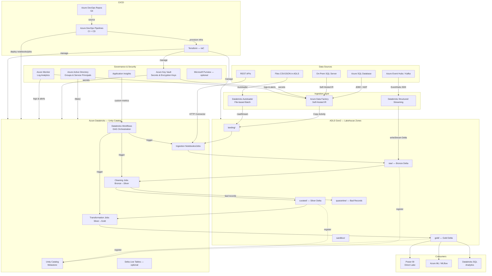

# Architecture & Design Document — Azure Lakehouse Platform

> **Agent:** Architect & Orchestrator Agent (Lead)  
> **Version:** 1.0  
> **Date:** 2026-06-23

---

## 1. Executive Summary

This document defines the end-to-end reference architecture for an Azure-native Lakehouse data platform built on:

| Pillar | Service |
|---|---|
| Compute & Processing | Azure Databricks (Unity Catalog enabled) |
| Storage | Azure Data Lake Storage Gen2 (ADLS Gen2) |
| Orchestration | Databricks Workflows (primary) + Azure Data Factory (secondary for non-Spark ingestion) |
| Identity & Access | Azure Active Directory + Databricks Unity Catalog RBAC |
| Secrets Management | Azure Key Vault |
| CI/CD | Azure DevOps Repos + Azure DevOps Pipelines |
| Monitoring | Azure Monitor + Log Analytics + Application Insights |
| Compliance | GDPR / SOC2 – PII handling required |

---

## 2. Orchestration Decision: Databricks Workflows vs ADF

**Decision: Databricks Workflows as the primary orchestrator; ADF retained for non-Spark data movement only.**

| Criterion | Databricks Workflows | Azure Data Factory |
|---|---|---|
| Spark-native jobs | Native | Requires Linked Service overhead |
| Dependency graph | Multi-task DAG with retries | Pipeline activities |
| Streaming triggers | Built-in continuous mode | Limited |
| Cost | Included in DBR licensing | Extra ADF unit costs |
| GitOps support | REST API + Databricks CLI | ARM templates only |
| Verdict | **Primary orchestrator** | File movement from on-prem SQL (Self-Hosted IR) |

**Justification:** For an all-Databricks processing stack, keeping orchestration inside Databricks Workflows eliminates cross-service authentication complexity and gives tighter integration with Unity Catalog lineage tracking. ADF is kept solely for its Self-Hosted Integration Runtime capability to copy data from on-premises SQL Server to ADLS Gen2 landing zone, after which all processing is owned by Databricks.

---

## 3. High-Level Architecture



---

## 4. ADLS Gen2 Zone & Directory Structure

```
adls-account/
├── landing/
│   ├── domain=sales/
│   │   ├── source=azure_sql/
│   │   └── source=api/
│   └── domain=finance/
│       └── source=onprem_sql/
├── raw/                          ← Bronze Delta tables
│   ├── domain=sales/
│   │   └── entity=orders/
│   └── domain=finance/
│       └── entity=invoices/
├── curated/                      ← Silver Delta tables
│   ├── domain=sales/
│   └── domain=finance/
├── gold/                         ← Gold Delta tables (star schema / wide tables)
│   ├── domain=sales/
│   │   ├── dim_customer/
│   │   ├── dim_product/
│   │   └── fact_sales/
│   └── domain=finance/
├── quarantine/                   ← Bad / rejected records
│   ├── domain=sales/
│   └── domain=finance/
└── sandbox/                      ← Ad-hoc / data science experiments
    └── user={username}/
```

**Container-level POSIX ACLs** enforced via Azure AD groups (see Security Agent output).

---

## 5. Data Flow Narrative

### 5.1 Batch Path

1. **ADF / Autoloader** copies/reads raw files → `landing/{domain}/{source}/`
2. **Bronze Job** reads from `landing/` using Databricks Autoloader (`cloudFiles`) → writes Delta to `raw/` (append-only, schema evolution enabled).
3. **Silver Job** reads Bronze Delta → applies cleaning rules → writes to `curated/` (merge/upsert using Delta MERGE).
4. **Gold Job** reads Silver Delta → applies business rules, aggregations, SCDs → writes to `gold/`.
5. **Power BI / Databricks SQL** connects to Gold Delta via Unity Catalog.

### 5.2 Streaming Path

1. **Event Hubs** (or Kafka with Confluent) → Databricks Structured Streaming reads as micro-batch.
2. Writes to `raw/` Bronze Delta tables continuously.
3. Silver and Gold layers run on scheduled micro-batch cadence or trigger-based intervals.

### 5.3 Quarantine Flow

- Records failing validation in the Silver job → written to `quarantine/` Delta table with error_reason, source_batch_id, and timestamp.
- Alert fired via Azure Monitor → on-call team investigates → re-ingestion job available on-demand.

---

## 6. Component Responsibilities

| Component | Agent Owner | Key Azure / Databricks Services |
|---|---|---|
| Ingestion (batch & streaming) | Data Ingestion Agent | ADF, Databricks Autoloader, Event Hubs |
| Bronze → Silver cleaning | Data Cleaning Agent | Databricks PySpark, Delta MERGE |
| Silver → Gold modeling | Transformation Agent | Databricks SQL, Delta Z-Order, Unity Catalog |
| Data quality enforcement | DQ & Observability Agent | Great Expectations, Azure Monitor, Log Analytics |
| Security & governance | Security & Governance Agent | Azure AD, Unity Catalog, Key Vault, ADLS ACLs |
| CI/CD & infra provisioning | CI/CD & DevOps Agent | Azure DevOps Pipelines, Terraform, Databricks CLI |

---

## 7. Unity Catalog Structure

```
Unity Catalog Metastore
├── catalog: dev_lakehouse
│   ├── schema: bronze
│   ├── schema: silver
│   └── schema: gold
├── catalog: test_lakehouse
│   ├── schema: bronze
│   ├── schema: silver
│   └── schema: gold
└── catalog: prod_lakehouse
    ├── schema: bronze
    ├── schema: silver
    └── schema: gold
```

Each environment maps to a separate Databricks workspace (dev / test / prod) connected to the same Unity Catalog Metastore, promoting isolation with a single governance plane.

---

## 8. Task Breakdown for Specialist Agents

| # | Agent | Primary Deliverables |
|---|---|---|
| 1 | Data Ingestion Agent | Autoloader PySpark, ADF config, Event Hubs streaming, metadata logging |
| 2 | Data Cleaning Agent | Bronze/Silver schemas, cleaning rules, quarantine handler |
| 3 | Transformation Agent | Gold schemas, SCD2, star schema SQL/PySpark |
| 4 | DQ & Observability Agent | Great Expectations configs, Azure Monitor alerts, incident playbook |
| 5 | Security & Governance Agent | RBAC model, Unity Catalog grants, Key Vault patterns, masking |
| 6 | CI/CD & DevOps Agent | Azure Pipelines YAML (CI + CD), Terraform IaC, repo structure |

---

## 9. Key Assumptions & Constraints

1. Azure Databricks Premium tier (required for Unity Catalog).
2. All PySpark code targets Databricks Runtime 14.x (Spark 3.5).
3. Unity Catalog is enabled on the Metastore; all tables are registered.
4. Secrets are never hardcoded; always fetched from Azure Key Vault via Databricks secret scopes.
5. Delta Lake is the only table format used (no Parquet-only or Hive external tables).
6. GDPR compliance requires column-level masking of PII in Silver+ layers.
7. All infrastructure is provisioned via Terraform; no manual Azure Portal configuration.
8. Azure DevOps is used for both version control and pipeline execution.
